# Ensuring Quality Releases

## overview
This project is designed to ensure the quality of releases in Azure Pipelines. It uses a combination of automated testing, manual testing, and code reviews to ensure that releases are stable, secure, and meet the requirements of stakeholders.

There are three stages in az piplines 
1. Build
2. deploy 
3. Test

## Build
* Terraform install
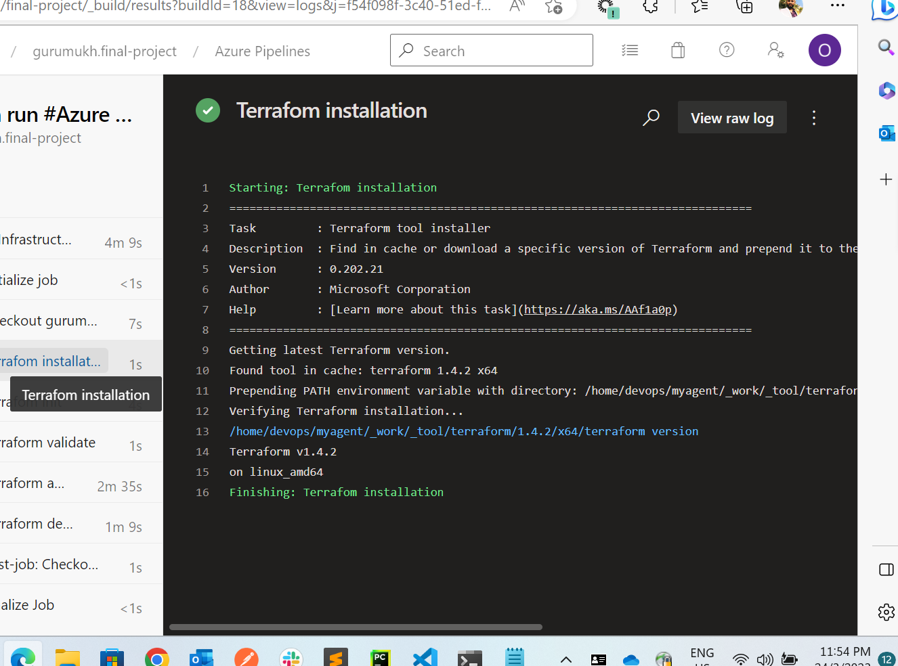

* Terraform init
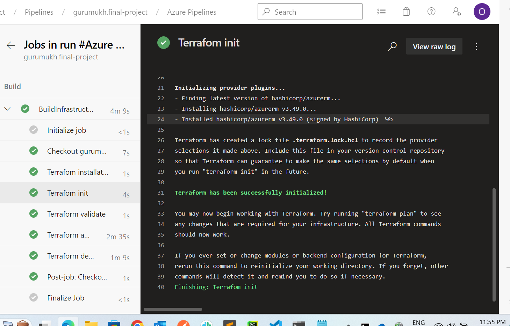

* Terraform validate
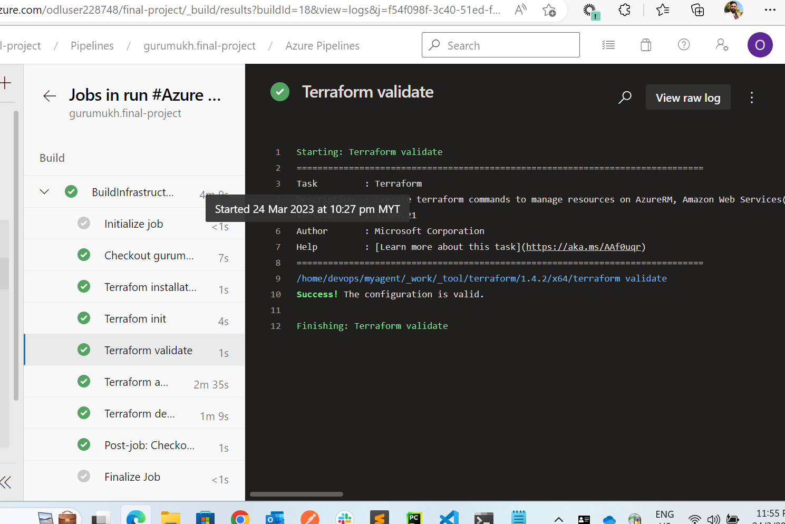

* Terraform apply
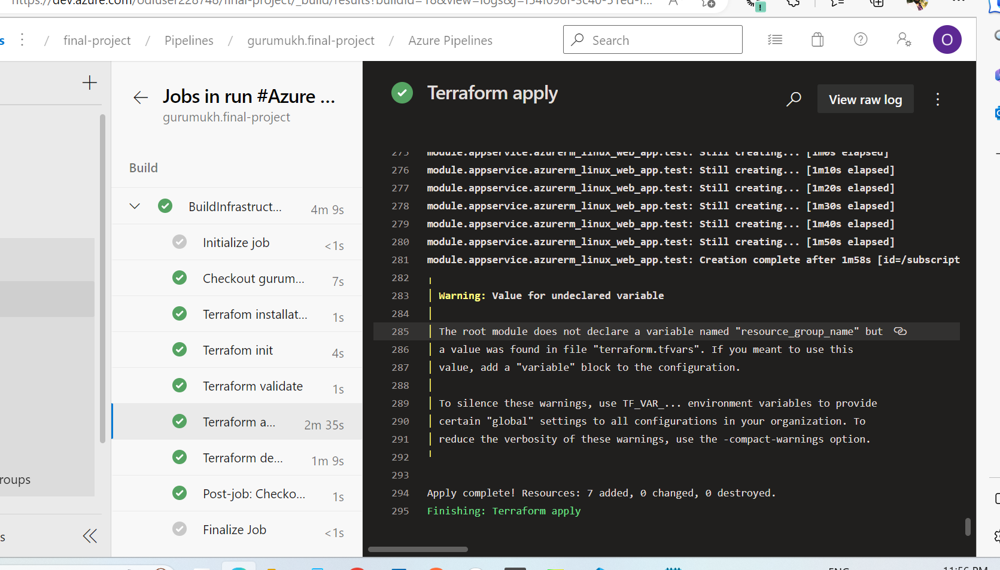

## Deploy
* deploy webapp
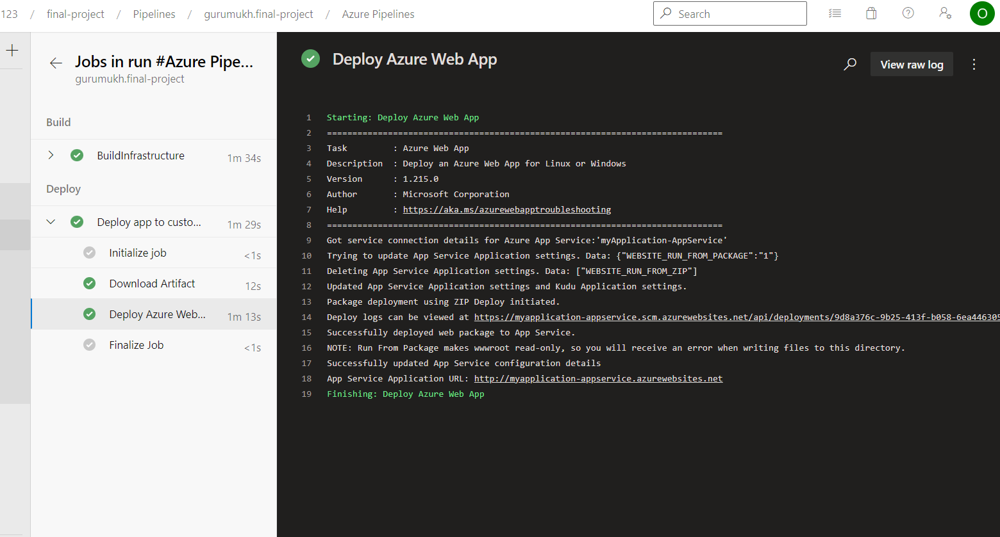
## Test
### Postman Tests
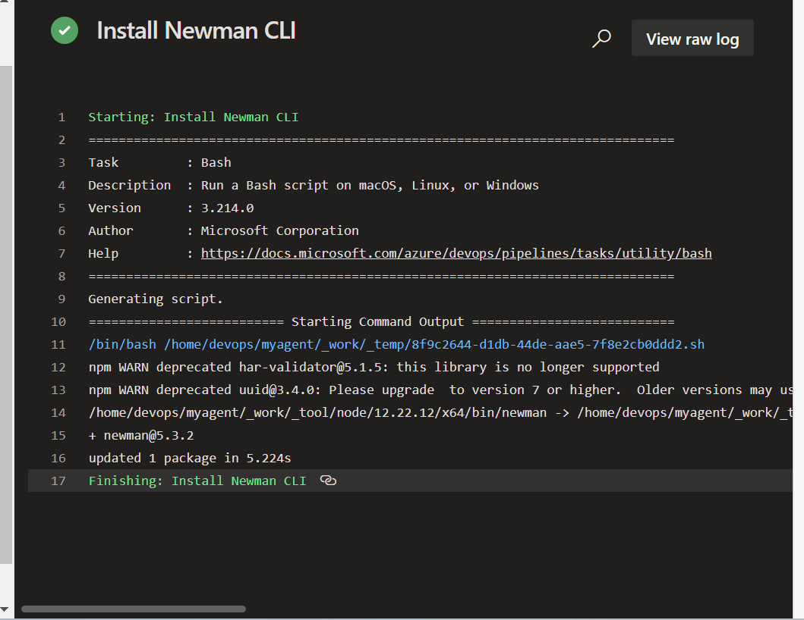

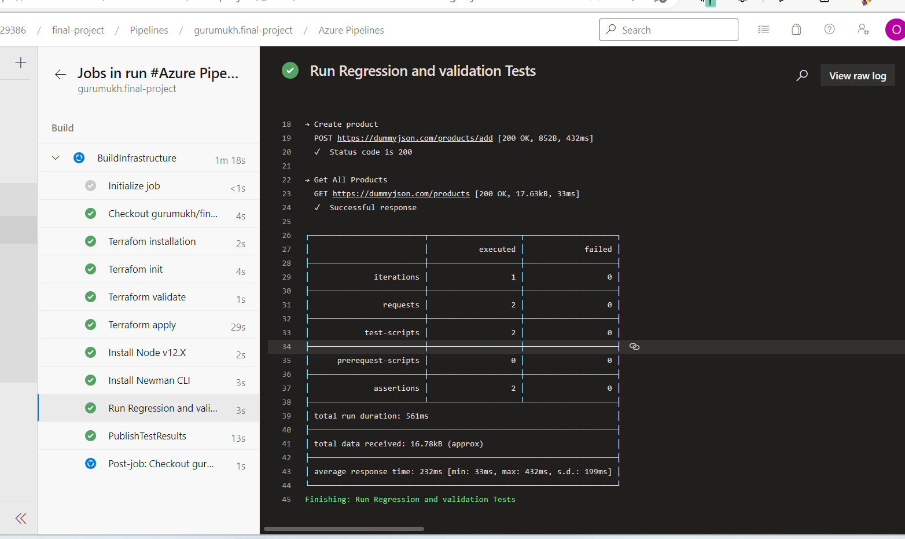
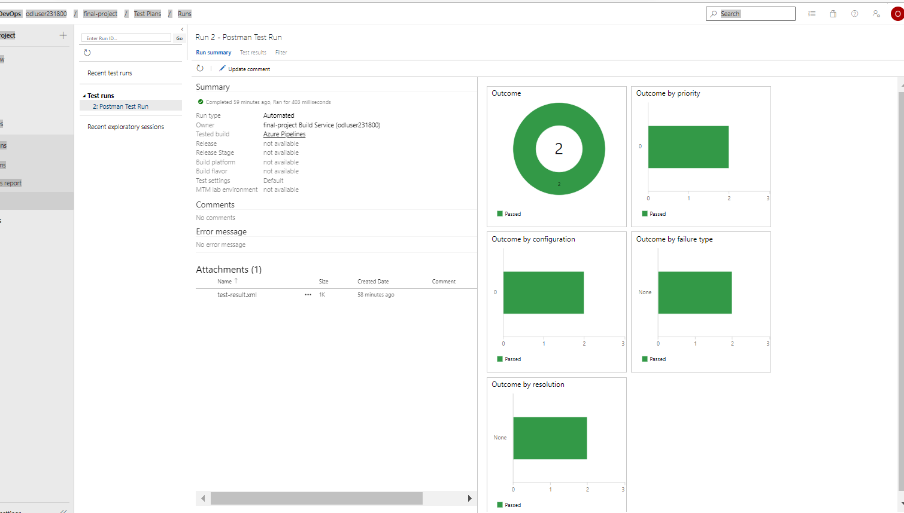

### Jmeter Test
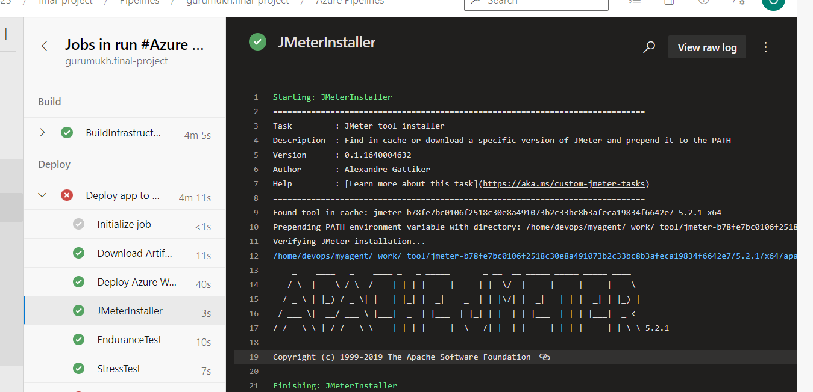
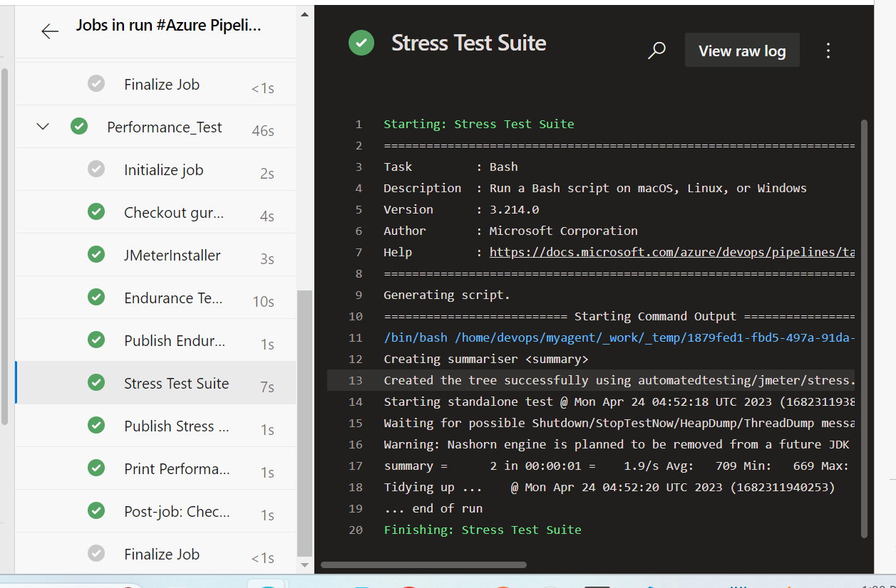
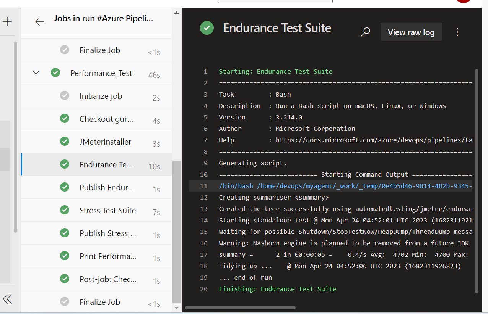
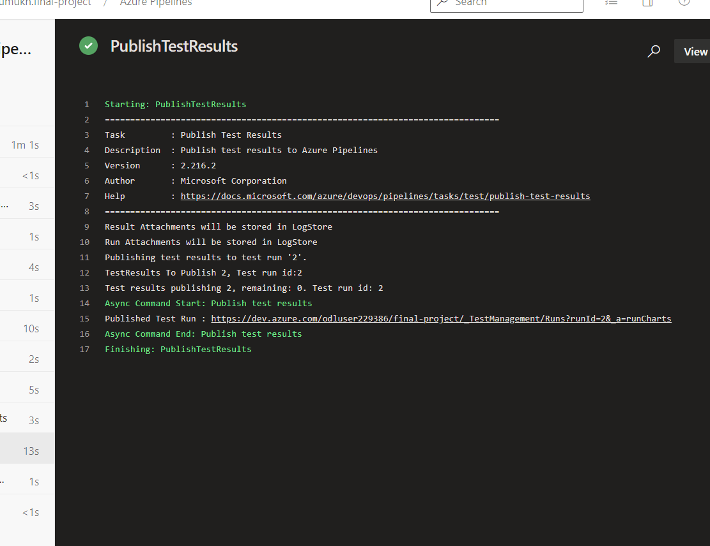
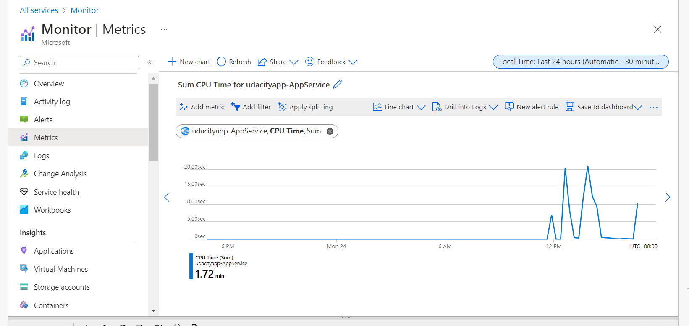

### Selenium test

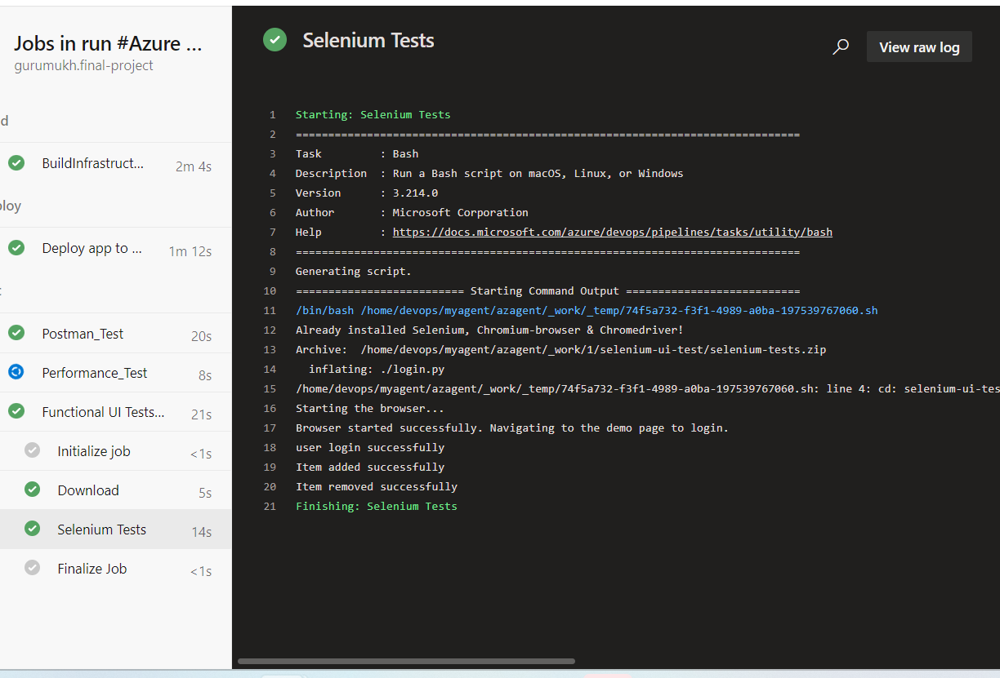

### Email Alert and monitoring
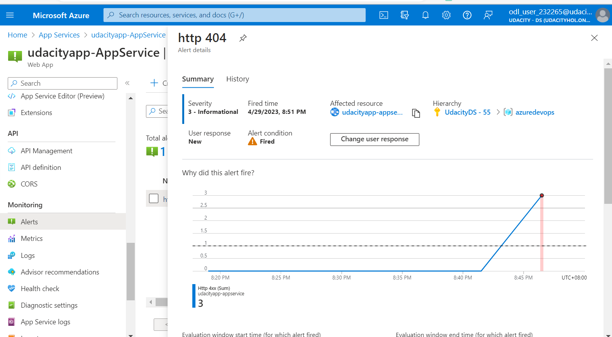
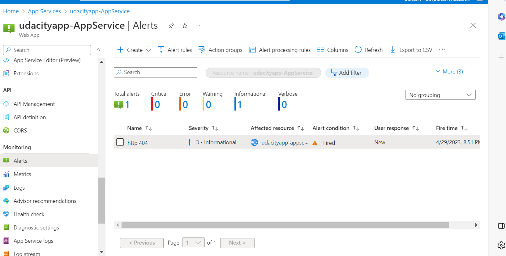
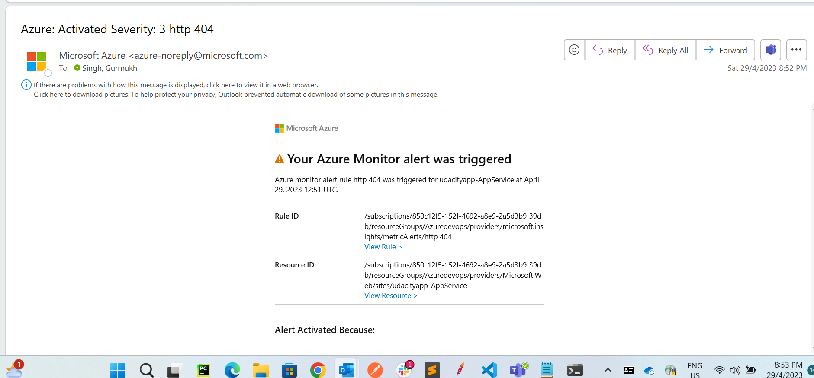
